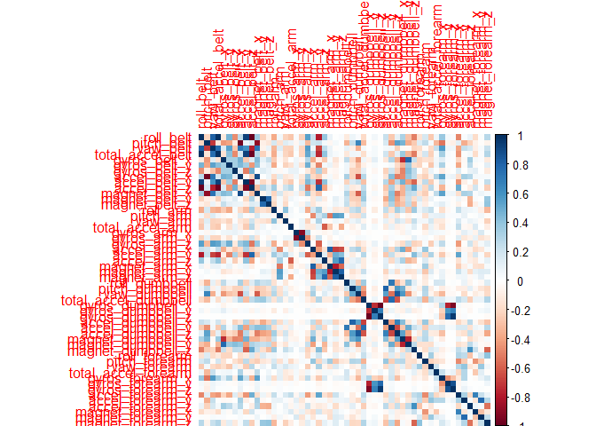
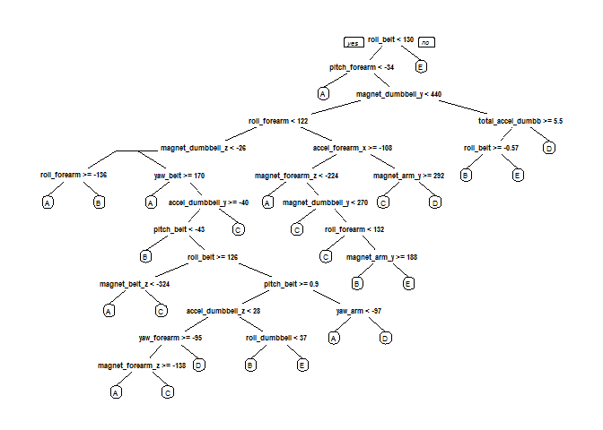

# Practical Machine Learning - Course Project
Reinhard Stockinger  
4 Mai 2017  


## Introduction

Using devices such as Jawbone Up, Nike FuelBand, and Fitbit it is now possible to collect a large amount of data about personal activity relatively inexpensively. These type of devices are part of the quantified self movement - a group of enthusiasts who take measurements about themselves regularly to improve their health, to find patterns in their behavior, or because they are tech geeks. One thing that people regularly do is quantify how much of a particular activity they do, but they rarely quantify how well they do it. In this project we will use data from accelerometers on the belt, forearm, arm and dumbell of 6 participants to predict the manner in which they did the exercise. 

## Exploratory data analysis

The training data was downloaded from this location:

https://d396qusza40orc.cloudfront.net/predmachlearn/pml-training.csv

The test data was downloaded from this location:

https://d396qusza40orc.cloudfront.net/predmachlearn/pml-testing.csv

### Read the data

Load all needed libs and read the data into dataframes


```r
library(caret)
```

```
## Loading required package: lattice
```

```
## Loading required package: ggplot2
```

```r
library(rpart)
library(rpart.plot)
library(randomForest)
```

```
## randomForest 4.6-12
```

```
## Type rfNews() to see new features/changes/bug fixes.
```

```
## 
## Attaching package: 'randomForest'
```

```
## The following object is masked from 'package:ggplot2':
## 
##     margin
```

```r
library(corrplot)
```


```r
#load the data
trainRaw<-read.csv("pml-training.csv")
testRaw<-read.csv("pml-testing.csv")

dim(trainRaw)
```

```
## [1] 19622   160
```

```r
dim(testRaw)
```

```
## [1]  20 160
```

```r
str(trainRaw$classe)
```

```
##  Factor w/ 5 levels "A","B","C","D",..: 1 1 1 1 1 1 1 1 1 1 ...
```

The training data set contains 19622 observations and 160 variables, while the testing data set contains 20 observations and 160 variables. The "classe" variable in the training set is the outcome to predict.

### Clean the data


```r
#check for missing data
sum(complete.cases(trainRaw))
```

```
## [1] 406
```

```r
# remove all columns with missing values (NA)
trainRaw <- trainRaw[, colSums(is.na(trainRaw)) == 0] 
testRaw <- testRaw[, colSums(is.na(testRaw)) == 0] 

#get rid of some columns that do not contribute much to the accelerometer measurements.
classe <- trainRaw$classe
trainRemove <- grepl("^X|timestamp|window", names(trainRaw))
trainRaw <- trainRaw[, !trainRemove]
trainCleaned <- trainRaw[, sapply(trainRaw, is.numeric)]
trainCleaned$classe <- classe
testRemove <- grepl("^X|timestamp|window", names(testRaw))
testRaw <- testRaw[, !testRemove]
testCleaned <- testRaw[, sapply(testRaw, is.numeric)]

dim(trainCleaned)
```

```
## [1] 19622    53
```

```r
dim(testCleaned)
```

```
## [1] 20 53
```
Now, the cleaned training data set contains 19622 observations and 53 variables, while the testing data set contains 20 observations and 53 variables. The "classe" variable is still in the cleaned training set.

## Data Modeling

First we split the cleaned training set into a pure training data set (70%) and a validation data set (30%). We will use the validation data set to conduct cross validation in future steps.


```r
set.seed(3385) # For reproducibility
inTrain <- createDataPartition(trainCleaned$classe, p=0.70, list=F)
trainData <- trainCleaned[inTrain, ]
testData <- trainCleaned[-inTrain, ]
```

We fit a predictive model for activity recognition using **Random Forest** algorithm because it automatically selects important variables and is robust to correlated covariates & outliers in general. We will use **5-fold cross validation** when applying the algorithm.


```r
controlRf <- trainControl(method="cv", 5)
modelRf <- train(classe ~ ., data=trainData, method="rf", trControl=controlRf, ntree=250)
modelRf
```

```
## Random Forest 
## 
## 13737 samples
##    52 predictor
##     5 classes: 'A', 'B', 'C', 'D', 'E' 
## 
## No pre-processing
## Resampling: Cross-Validated (5 fold) 
## Summary of sample sizes: 10989, 10990, 10990, 10989, 10990 
## Resampling results across tuning parameters:
## 
##   mtry  Accuracy   Kappa    
##    2    0.9903912  0.9878445
##   27    0.9908280  0.9883975
##   52    0.9861688  0.9825014
## 
## Accuracy was used to select the optimal model using  the largest value.
## The final value used for the model was mtry = 27.
```

Then, we estimate the performance of the model on the validation data set.


```r
predictRf <- predict(modelRf, testData)
confusionMatrix(testData$classe, predictRf)
```

```
## Confusion Matrix and Statistics
## 
##           Reference
## Prediction    A    B    C    D    E
##          A 1672    0    1    0    1
##          B    9 1125    5    0    0
##          C    0    6 1016    4    0
##          D    0    0    9  954    1
##          E    0    1    3    6 1072
## 
## Overall Statistics
##                                           
##                Accuracy : 0.9922          
##                  95% CI : (0.9896, 0.9943)
##     No Information Rate : 0.2856          
##     P-Value [Acc > NIR] : < 2.2e-16       
##                                           
##                   Kappa : 0.9901          
##  Mcnemar's Test P-Value : NA              
## 
## Statistics by Class:
## 
##                      Class: A Class: B Class: C Class: D Class: E
## Sensitivity            0.9946   0.9938   0.9826   0.9896   0.9981
## Specificity            0.9995   0.9971   0.9979   0.9980   0.9979
## Pos Pred Value         0.9988   0.9877   0.9903   0.9896   0.9908
## Neg Pred Value         0.9979   0.9985   0.9963   0.9980   0.9996
## Prevalence             0.2856   0.1924   0.1757   0.1638   0.1825
## Detection Rate         0.2841   0.1912   0.1726   0.1621   0.1822
## Detection Prevalence   0.2845   0.1935   0.1743   0.1638   0.1839
## Balanced Accuracy      0.9971   0.9954   0.9903   0.9938   0.9980
```

```r
accuracy <- postResample(predictRf, testData$classe)
accuracy
```

```
##  Accuracy     Kappa 
## 0.9921835 0.9901120
```

```r
oose <- 1 - as.numeric(confusionMatrix(testData$classe, predictRf)$overall[1])
oose
```

```
## [1] 0.007816483
```

So, the estimated accuracy of the model is 99.30% and the estimated out-of-sample error is 0.70%.

## Prediction for the Test Data Set

Now, we apply the model to the original testing data set downloaded from the data source. We remove the `problem_id` column first.


```r
result <- predict(modelRf, testCleaned[, -length(names(testCleaned))])
result
```

```
##  [1] B A B A A E D B A A B C B A E E A B B B
## Levels: A B C D E
```

## Appendix

### Figures

**Correlation Matrix Visualization**


```r
corrPlot <- cor(trainData[, -length(names(trainData))])
corrplot(corrPlot, method="color")
```

<!-- -->

**Decision Tree Visualization**


```r
treeModel <- rpart(classe ~ ., data=trainData, method="class")
prp(treeModel) # fast plot
```

<!-- -->
